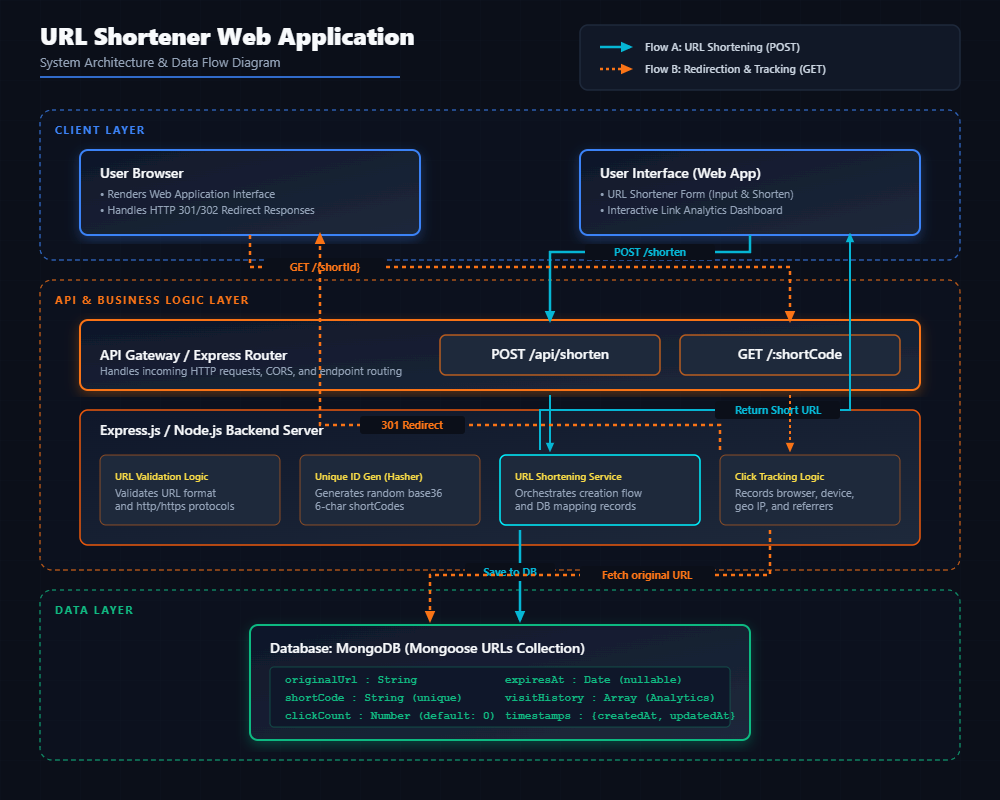
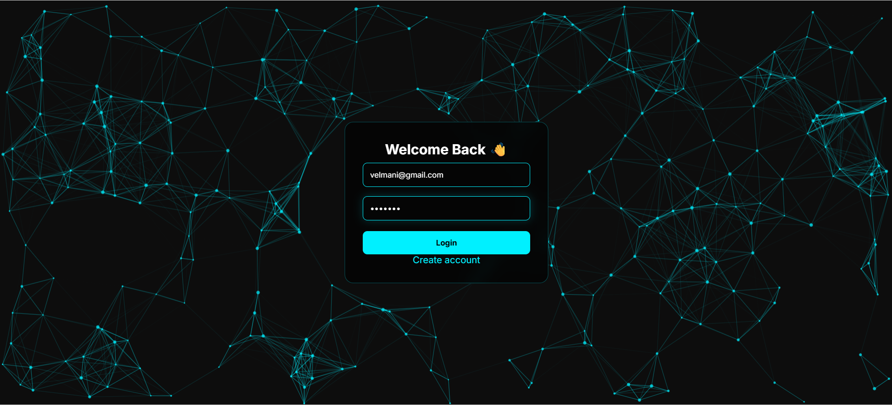
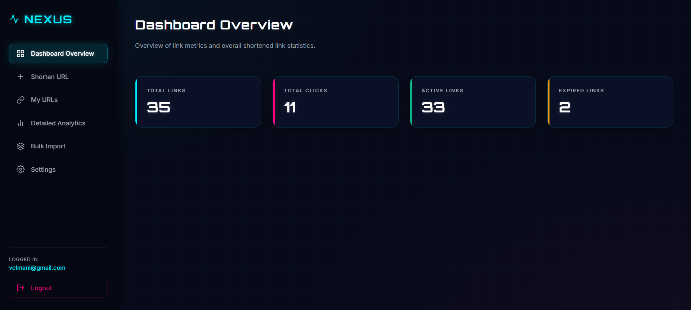
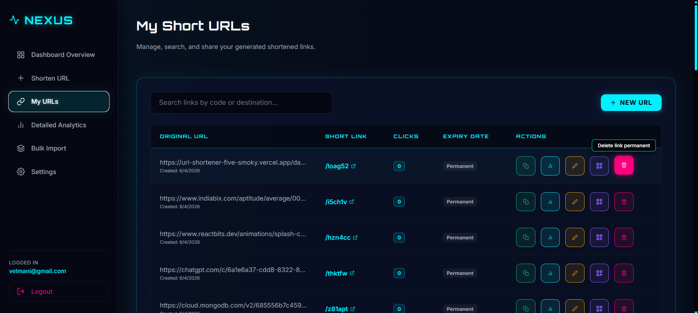
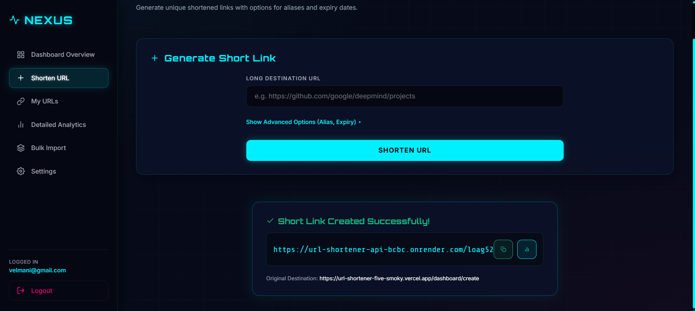
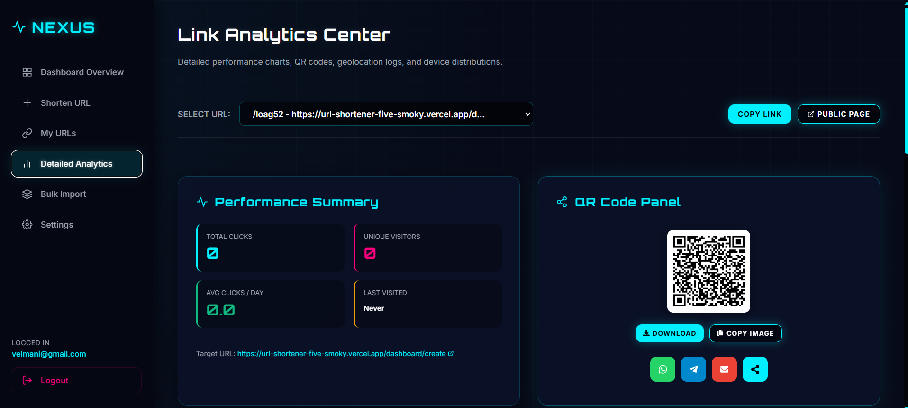
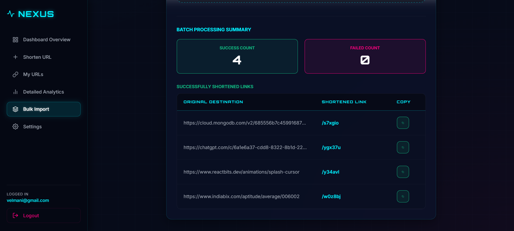
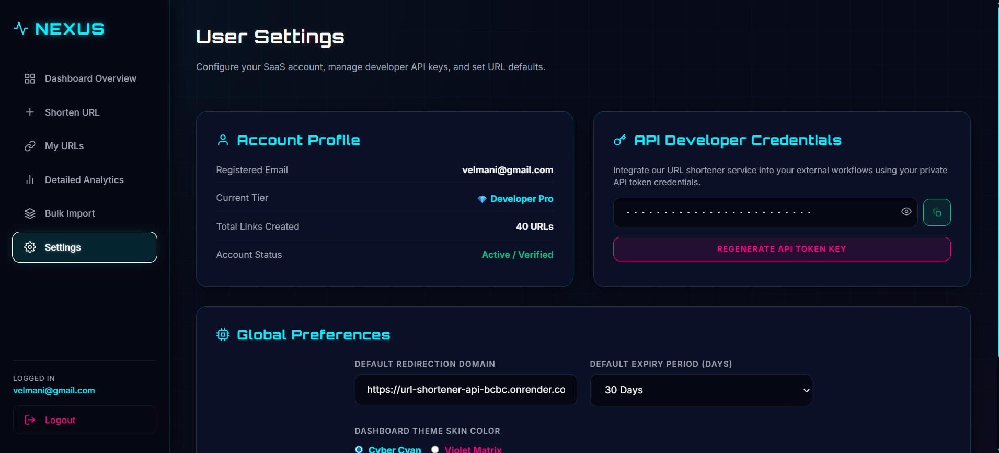
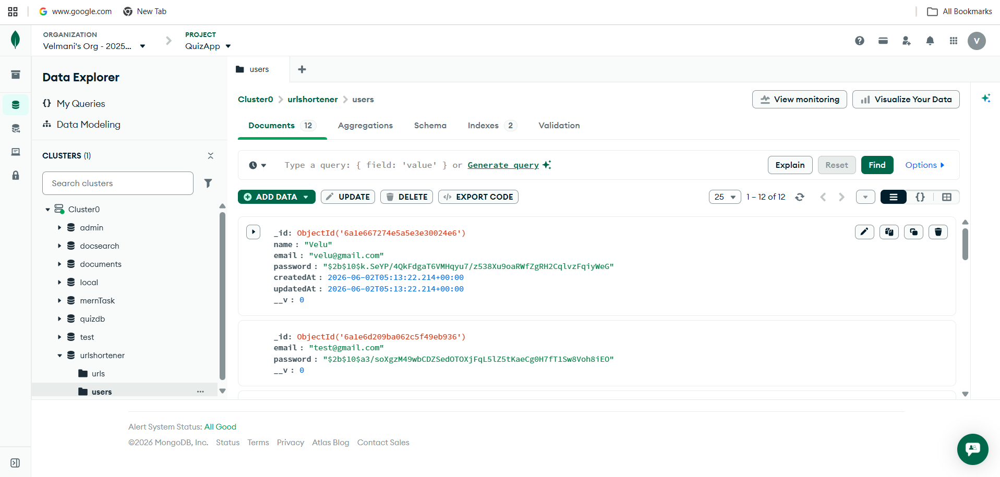
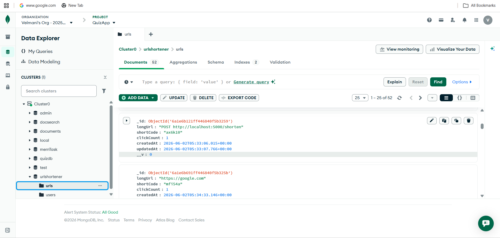

#  URL Shortener with Analytics Dashboard

A full-stack URL Shortener web application that allows users to generate short links, manage URLs, and track detailed analytics like click counts, recent visits, and creation history. Built as part of a hackathon project to demonstrate full-stack development skills including API design, authentication flow, database modeling, and analytics tracking.

## 🔗 Links

- Deployment link: https://url-shortener-five-smoky.vercel.app/

- Youtube Explanation Link: https://www.youtube.com/watch?v=goFLGfLJUeI

## Features

-  User authentication (secure access to dashboard)
-  Generate short URLs from long links
-  Real-time analytics (click count, visit history)
-  Manage all created URLs in a personal dashboard
-  Bulk URL shortening support
-  Settings panel for user preferences
-  Performance insights for each shortened link
-  Fast redirection system with click logging
-  Backend API for URL generation and tracking

##  How It Works

1. User logs in and accesses dashboard  
2. Enters a long URL  
3. System generates a unique short URL  
4. Every click is tracked in backend  
5. Analytics dashboard updates in real-time  
6. Users can manage or delete URLs  

## Architecture Diagram 

##  Project Screenshots

###  Login Page

###  Dashboard Overview

###  My URLs Section

###  Short URL Generator

###  Analytics Page

###  Bulk URL Shortener

###  Settings Page

##  Backend Overview

### Backend Architecture

### API & Data Flow

##  Tech Stack

- **Frontend:** React / Vite / Tailwind CSS  
- **Backend:** Node.js / Express  
- **Database:** MongoDB  
- **Authentication:** JWT-based auth  
- **Analytics:** Custom click tracking system  

## ⚙️ Setup Instructions

### 1. Clone Repository
git clone https://github.com/Velmani357/url-shortener
cd url-shortener

### 2. Install Dependencies
Frontend:
 cd client
 npm install

Backend:
 cd ../server
 npm install

### 3. Environment Variables

MONGO_URI=your_mongodb_url
JWT_SECRET=your_secret_key
PORT=5000
 
### 4. Run Project
 
 Frontend-backend = npm run dev

 ## 🤖 AI Usage in This Project

AI tools were used to assist in building this project:

- Helped generate React UI components
- Assisted in building Node.js backend APIs
- Helped design MongoDB schema for storing URLs and analytics
- Assisted in debugging and fixing errors
- Helped in writing project documentation

All AI-generated code was reviewed, understood, and tested manually.

# This project is a part of a hackathon run by https://katomaran.com